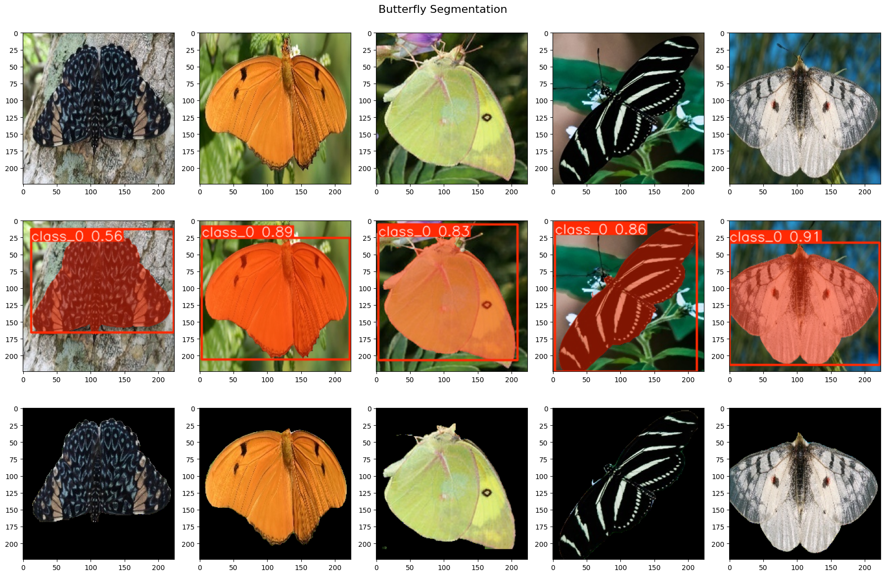
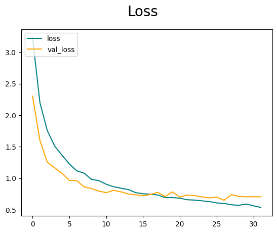
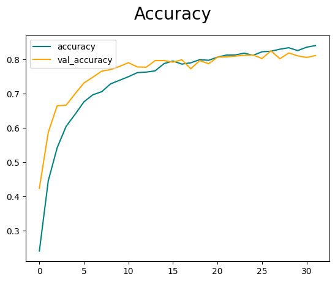

# Classifly

Image classification of 75 butterfly species using transfer learning with YOLOv8 for image segmentation and ConvNeXt Large for classification.

**Accuracy**: 0.8246

### Image Segmentation

The model is trained to detect butterflies and generate a binary mask for the given image. If detection is successful, the mask is applied to the original image to remove irrelevant background elements. However, if no butterfly is detected, the original image remains unchanged. Each image is then fed into an image augmentation pipeline (resizing, shifting, rotating, etc.) before being used for model training.

### Classification loss and accuracy

  
  

The ConvNeXt Large model was used for feature extraction, with custom layers added for classifying images into 75 classes. Training was stopped at the 32nd epoch due to early stopping, and the model's weights were restored to those from the 26th epoch. The final model achieved an accuracy of 0.8246.

### References
The segmentation model was trained with binary mask data from Leeds Butterfly Datasets: https://www.josiahwang.com/dataset/leedsbutterfly/

A very useful tutorial for image segmentation from Filipe: https://www.youtube.com/watch?v=aVKGjzAUHz0

The classification model was trained with data from the Butterfly Image Classification dataset: https://www.kaggle.com/datasets/phucthaiv02/butterfly-image-classification/

Some of the codes here are taken and modified from Timothy's notebook, you can check it out here: https://www.kaggle.com/code/timothymcahyana/butterfly-species-classification-convnext/notebook